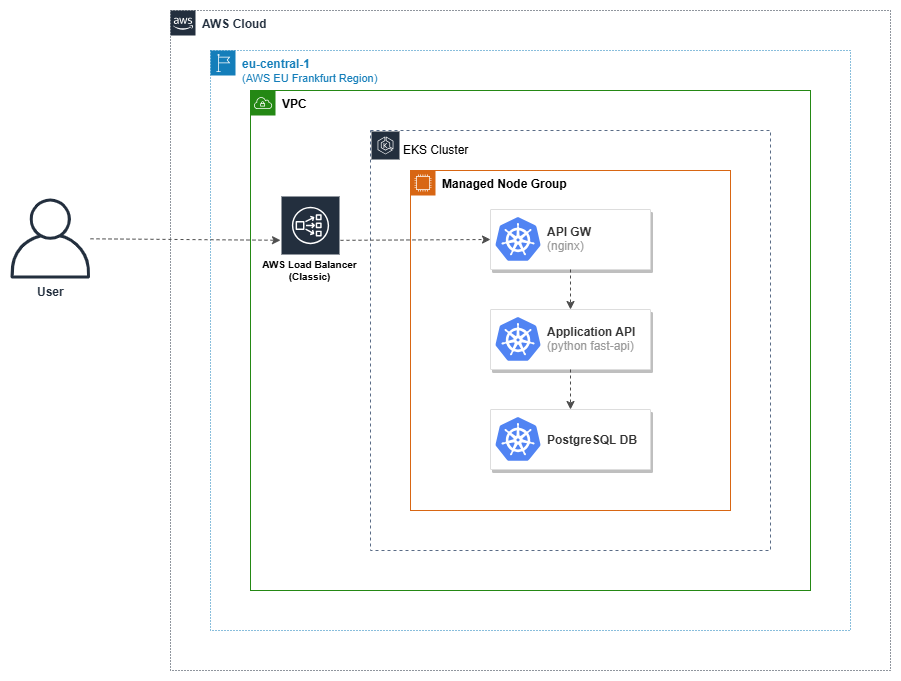
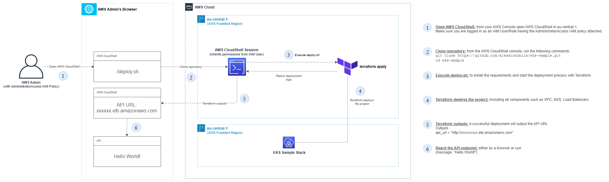

# EKS Sample

Abstract: A simple python fastapi web application deployed on EKS with Nginx as an API gateway and PostgreSQL as a database.

## Architecture



## Deployment & clean up

### Before you deploy ✅

Check your AWS IAM User or IAM Role permissions.
> **Warning:**
> Make sure you are logged in as an IAM User or IAM Role having the [AdministratorAccess](https://docs.aws.amazon.com/aws-managed-policy/latest/reference/AdministratorAccess.html) IAM managed policy attached.

The deployment requires AdministratorAccess to create CodeBuild pipelines, deploy CDK stacks, and respective IAM Roles.

### Deployment Architecture

This deployment architecture has been built with two objectives in mind:

**1. Deploy/destroy in one simple step:** stacks can be deployed/destroyed by running [deploy.sh](../main/deploy.sh) and [destroy.sh](../main/destroy.sh) from AWS CloudShell.

**2. Eliminate local libraries dependencies:** the workflow runs entirely on AWS services and does not require a local environment.
- [AWS CloudShell](https://aws.amazon.com/cloudshell/) is used to initiate a terminal session in your AWS Console and initiate deploy/destroy;
- [Terraform](https://developer.hashicorp.com/terraform) is used to deploy the [src/terraform](../main/src/terraform) project;



### How to deploy 🚀

1. Open [AWS CloudShell in eu-central-1](https://eu-central-1.console.aws.amazon.com/cloudshell/home?region=eu-central-1#)
2. Run the deployment via the following commands

```sh
git clone https://github.com/alessionobile/eks-sample.git
cd eks-sample
./deploy.sh
```

3. After about 15 minutes you will get the following output:

```
Apply complete! Resources: 53 added, 0 changed, 0 destroyed.

Outputs:

api_url = "http://XXXXXXXXXXXXXXXXX.eu-central-1.elb.amazonaws.com"
cluster_arn = "arn:aws:eks:eu-central-1:XXXXXXXXXX:cluster/eks-sample"
cluster_name = "eks-sample"
kubectl_auto_config = "aws eks update-kubeconfig --region eu-central-1 --name eks-sample"
region = "eu-central-1"
2025-04-29 06:56:20 [EKSSample] [Terraform] ✅ Deployment completed.
```

4. Curl or browse the ```api_url``` reported in the output.

### Clean up

1. Open [CloudShell in eu-central-1](https://eu-central-1.console.aws.amazon.com/cloudshell/home?region=eu-central-1#)
2. Destroy the environment with the following commands:

```sh
./destroy.sh
```

The process will take about 15 minutes to complete.

## License

This library is licensed under the MIT-0 License. See the [LICENSE](./LICENSE) file.
